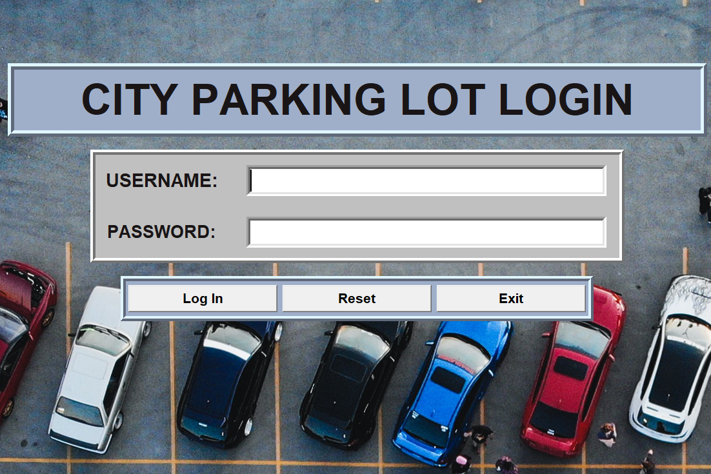

# Automatic Car Parking System

> This is a desktop based (client/server) Automatic Car Parking system that assigns slots to cars.

---

### Table of Contents

- [Description](#description)
- [How To Use](#how-to-use)
- [References](#references)
- [License](#license)
- [Author Info](#author-info)

---

## Description
This is a desktop based (client/server) Automatic Car Parking system that assigns slots to cars, the project incorporates Sqlite3 database system to record events and entities. It is entirely written in Python and the Graphic User Interface was designed with Tkinter library. The application collects plate numbers as a unique identifier and assigns an equally unique slot number to the vehicle. At the car's exit, total time parked is calculated and the bill is automatically generated.

#### Technologies

- Python
- Tkinter Library
- Sqlite3
- PyCharm

[Back To The Top](#automatic-car-parking-system)

---

## How To Use

Main Project Folder available in `master` branch.
For now, you will need DB Browser (Sqlite3) to store the program's data locally.
Run "server.py" to initialize the server (on local machine). Then run GUI_main.py using Python 3.

Default login details to access dashboard:
Username: admin
Password: admin

#### Installations

For tkinter background image
`pip install pillow`

---

## References

- LinkedIn - [Mary-Ann Egbudom](https://www.linkedin.com/in/mary-ann-egbudom-9017b3109)
- Twitter - [@Rianne_egb](https://twitter.com/Rianne_egb)

[Back To The Top](#automatic-car-parking-system)

---

## License

MIT License

Copyright (c) [2022] [Mary-Ann Egbudom]

Permission is hereby granted, free of charge, to any person obtaining a copy
of this software and associated documentation files (the "Software"), to deal
in the Software without restriction, including without limitation the rights
to use, copy, modify, merge, publish, distribute, sublicense, and/or sell
copies of the Software, and to permit persons to whom the Software is
furnished to do so, subject to the following conditions:

The above copyright notice and this permission notice shall be included in all
copies or substantial portions of the Software.

THE SOFTWARE IS PROVIDED "AS IS", WITHOUT WARRANTY OF ANY KIND, EXPRESS OR
IMPLIED, INCLUDING BUT NOT LIMITED TO THE WARRANTIES OF MERCHANTABILITY,
FITNESS FOR A PARTICULAR PURPOSE AND NONINFRINGEMENT. IN NO EVENT SHALL THE
AUTHORS OR COPYRIGHT HOLDERS BE LIABLE FOR ANY CLAIM, DAMAGES OR OTHER
LIABILITY, WHETHER IN AN ACTION OF CONTRACT, TORT OR OTHERWISE, ARISING FROM,
OUT OF OR IN CONNECTION WITH THE SOFTWARE OR THE USE OR OTHER DEALINGS IN THE
SOFTWARE.

[Back To The Top](#automatic-car-parking-system)

---

## Author Info

- LinkedIn - [Mary-Ann Egbudom](https://www.linkedin.com/in/mary-ann-egbudom-9017b3109)
- Twitter - [@Rianne_egb](https://twitter.com/Rianne_egb)

[Back To The Top](#automatic-car-parking-system)
